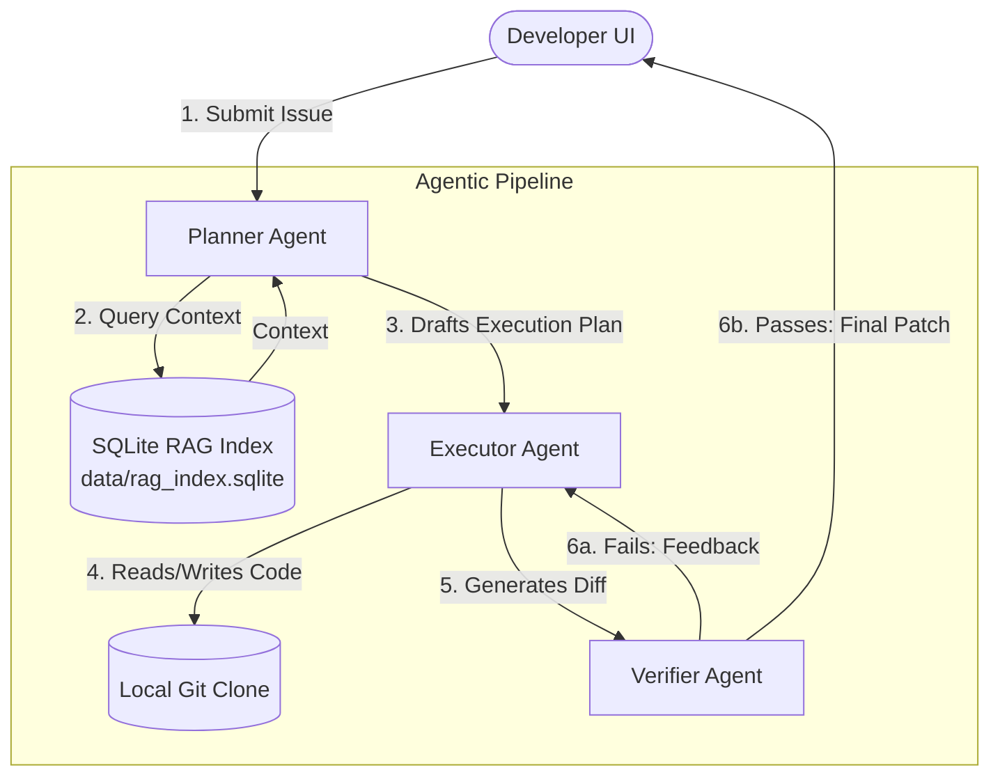

# TaskChain — Autonomous Coding Workspace

[](https://www.python.org/downloads/)
[](https://openai.com/)
[](https://opensource.org/licenses/MIT)

**TaskChain** is an autonomous developer agent system designed to automate public GitHub repository issue resolution. Rather than operating as a simple chat assistant, TaskChain functions as an end-to-end autonomous workspace powered by a rigid **Planner → Executor → Verifier** pipeline. 

By leveraging **OpenAI** models and a highly efficient **SQLite-based RAG (Retrieval-Augmented Generation) index** with optional reranking, TaskChain seamlessly understands complex codebases, formulates execution plans, writes code, and verifies its own work.

---

## 🚀 Key Features

### 1. Planner → Executor → Verifier Pipeline
TaskChain separates the coding process into three distinct, specialized agent roles to ensure high-quality code generation and minimize hallucinations:
- **Planner Agent:** Analyzes the submitted GitHub issue, queries the local repository index for context, and breaks down the solution into a step-by-step technical execution plan.
- **Executor Agent:** Takes the formulated plan and autonomously applies targeted file modifications to the local repository clone.
- **Verifier Agent:** Evaluates the generated patch against the original issue requirements. If the verifier detects errors, it sends feedback back to the Executor for self-correction.

### 2. SQLite RAG Indexing & Reranking
TaskChain avoids heavy vector databases by utilizing a lightweight but powerful `data/rag_index.sqlite` full-text search database. 
- Automatically indexes repository source code, markdown documentation, and architectural "DNA".
- Includes an **optional Rerank Mode** that re-evaluates and sorts search results to provide the LLMs with only the highest-fidelity context.

### 3. OpenAI Integration
TaskChain is deeply integrated with OpenAI's API. It leverages advanced reasoning models to comprehend complex code logic, navigate project structures, and write production-ready code.

### 4. Minimalist Web Interface
A clean, lightweight web UI provides developers with a streamlined dashboard to:
- Connect and import public GitHub repositories.
- Paste issue links or feature requests.
- Monitor the real-time execution logs of the Planner, Executor, and Verifier pipeline.

---

## 🧠 System Architecture

The core of TaskChain revolves around a linear, self-correcting agent pipeline:



---

## 📂 Project Structure

```text
├── agent/
│   ├── planner.py             # Issue analysis and step-by-step plan generation
│   ├── executor.py            # Applies code edits based on the plan
│   └── verifier.py            # Reviews generated diffs and issues corrections
├── api/
│   └── server.py              # FastAPI application and UI endpoints
├── ingestion/
│   └── sqlite_indexer.py      # SQLite RAG indexer and reranking logic
├── ui/
│   ├── index.html             # Minimal UI homepage
│   └── styles.css             # UI styling
├── data/                      # Local storage for cloned repos and SQLite DB
├── tests/                     # Unit and integration test suites
├── config.py                  # Global settings and environment loading
├── requirements.txt           # Python dependencies
└── README.md                  # This documentation
```

---

## 🛠️ Getting Started

### Prerequisites
- Python 3.10 or higher
- An active OpenAI API Key

### 1. Installation
Clone the repository and set up a virtual environment:

```bash
git clone https://github.com/yourusername/taskchain-orchestrator.git
cd taskchain-orchestrator
python -m venv venv
source venv/bin/activate  # On Windows use `venv\Scripts\activate`
pip install -r requirements.txt
```

### 2. Configuration
Create a `.env` file in the root directory of the project.

```env
# Required: OpenAI API Key for the agent pipeline
OPENAI_API_KEY=sk-your_openai_api_key_here

# Database URL Connection String for RAG indexing
DATABASE_URL=sqlite:///data/rag_index.sqlite

# Optional: Enable reranking for better RAG precision (True/False)
ENABLE_RERANKER=True
```

### 3. Running the Application
Start the FastAPI server to serve the API and the minimal UI:

```bash
python -m uvicorn api.server:app --reload
```

Open your browser and navigate to `http://localhost:8000` to interact with the TaskChain dashboard.

### 4. Running the Tests
To ensure the pipeline is functioning correctly, you can run the test suite:

```bash
PYTHONPATH=. venv/bin/pytest -v
```

---

## 🤝 Contributing
Contributions, issues, and feature requests are welcome! Feel free to check the issues page if you want to contribute.

## 📝 License
This project is licensed under the MIT License.
