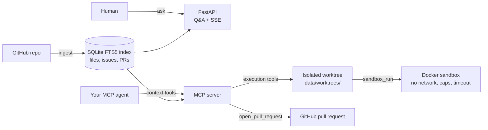

# TaskChain

**Repository intelligence and sandboxed execution, exposed over MCP.**

[](https://github.com/nik-shar/taskchain-orchestrator/actions/workflows/ci.yml)
[](https://www.python.org/downloads/)
[](LICENSE)
[](https://modelcontextprotocol.io/)

TaskChain indexes a GitHub repository end to end -- source files, documentation, issues and
pull requests -- and exposes the result to any [MCP](https://modelcontextprotocol.io/)-capable
agent, together with a hardened Docker sandbox and an isolated git worktree to work in.

It deliberately does **not** generate or apply code edits. Deciding what to change belongs to
the calling agent; TaskChain owns retrieval and isolation.

## Contents

- [Quickstart](#quickstart)
- [What it provides](#what-it-provides)
- [Architecture](#architecture)
- [Configuration](#configuration)
- [Testing](#testing)
- [Limitations](#limitations)
- [Documentation](#documentation)
- [Roadmap](#roadmap)
- [License](#license)

## Quickstart

**Prerequisites**

- Python 3.11 or newer
- An API key for an OpenAI-compatible LLM provider: OpenAI, Nebius, DeepSeek, or a local
  Ollama instance
- A GitHub token, required for ingestion and for `open_pull_request`
- Docker, required by `sandbox_run`, which fails closed without a daemon

**1. Install**

```bash
git clone https://github.com/nik-shar/taskchain-orchestrator.git
cd taskchain-orchestrator
python -m venv venv
source venv/bin/activate          # Windows: venv\Scripts\activate
pip install -r requirements.txt
```

**2. Configure** -- create `.env` (full template in `.env.example`):

```dotenv
LLM_PROVIDER=openai               # openai | nebius | deepseek | ollama
LLM_API_KEY=sk-your-api-key
GITHUB_TOKEN=ghp-your-github-token
DATABASE_URL=sqlite:///data/rag_index.sqlite
```

**3. Run the MCP server**

```bash
make mcp                          # stdio transport, for desktop and CLI agents
make mcp ARGS="--http"            # streamable HTTP on 127.0.0.1:8080
```

Client configuration (Claude Desktop / Cline style):

```json
{
  "mcpServers": {
    "taskchain": {
      "command": "/absolute/path/to/venv/bin/python",
      "args": ["-m", "mcp_server.server"],
      "env": {
        "PYTHONPATH": "/absolute/path/to/taskchain-orchestrator",
        "DATABASE_URL": "sqlite:///data/rag_index.sqlite",
        "GITHUB_TOKEN": "ghp_..."
      }
    }
  }
}
```

**4. Run the Q&A dashboard** (optional)

```bash
make api          # http://localhost:8000
```

## What it provides

TaskChain exposes 18 MCP tools in two groups. Parameters, return shapes and error semantics
are documented in [docs/mcp-tools.md](docs/mcp-tools.md).

**Context tools (read-only)**

| Tool | Purpose |
| --- | --- |
| `index_repository` | Ingest a public GitHub repo: metadata, docs, file tree, issues, PRs |
| `list_indexed_repos` | List ingested repositories with per-repo index sizes |
| `repo_summary` | Stored summary: purpose, tech stack, entry points, activity |
| `list_files`, `read_file` | Bounded, path-checked reads over the workspace |
| `search_code` | Keyword search over indexed source files (FTS5) |
| `search_issues` | Keyword search over indexed issues and pull requests (FTS5) |
| `repository_docs` | Curated documentation under a character budget |
| `suggest_plan` | Advisory approach for an issue: a plan, never an edit |

**Execution tools (isolated and sandboxed)**

| Tool | Purpose |
| --- | --- |
| `create_worktree` | Isolated, git-initialised copy of the repository |
| `write_file`, `delete_file`, `apply_patch` | Raw file primitives, path-checked |
| `sandbox_run` | Run a command in the Docker sandbox against the worktree |
| `suggested_test_command` | Test command inferred from the repository's manifests |
| `diff` | Real unified diff of what the agent changed |
| `discard_worktree` | Delete the worktree and everything in it |
| `open_pull_request` | Open a pull request through the GitHub API |

## Architecture



A session, in order:

```text
index_repository   { repo_url }                     -> index counts
search_code        { repo_id, query }               -> ranked files
read_file          { repo_id, path }                -> file contents
create_worktree    { repo_id }                      -> worktree_id
write_file         { worktree_id, path, content }   -> applied
sandbox_run        { worktree_id, command }         -> exit code and output
diff               { worktree_id }                  -> unified diff
open_pull_request  { owner, repo, title, body, head_branch }
discard_worktree   { worktree_id }
```

The division of responsibility is the point: TaskChain answers *what is in this repository,
and how do I run it safely?* The agent answers *what should change?*

**Security model**

1. Execution tools never accept a host filesystem path. They take the `worktree_id` returned
   by `create_worktree`, which is resolved under `config.WORKTREES_DIR` and verified to be
   inside it, so a client cannot aim the sandbox at an arbitrary directory.
2. Paths inside a worktree are re-resolved and checked before every read or write, so a
   `path` argument cannot escape the worktree either.
3. `sandbox_run` executes with `--network none`, a non-root user, memory/CPU/PID caps and a
   wall-clock timeout, and refuses to run when Docker is unavailable.
   `SANDBOX_ALLOW_HOST_FALLBACK=1` restores host execution for local development only.
4. The indexed workspace is read-only. Every change lands in a per-run worktree.

## Configuration

TaskChain is provider-agnostic: it talks to any OpenAI-compatible endpoint. Presets fill in
the endpoint and a default model; explicit values win over the preset.

| Provider | Configuration |
| --- | --- |
| OpenAI | `LLM_PROVIDER=openai`, `LLM_API_KEY=sk-...` |
| Nebius | `LLM_PROVIDER=nebius`, `LLM_API_KEY=<key>` |
| DeepSeek | `LLM_PROVIDER=deepseek`, `LLM_API_KEY=<key>` |
| Ollama (local) | `LLM_PROVIDER=ollama`; no key required |
| Any other endpoint | `LLM_BASE_URL=<endpoint>`, `LLM_MODEL=<model>`, `LLM_API_KEY=<key>` |

`OPENAI_API_KEY` is accepted as an alias for `LLM_API_KEY`.

`DATABASE_URL` must stay SQLite: the keyword index uses FTS5, which Postgres does not
provide (see [decision 7](docs/decisions.md)). Sandbox image, resource caps and timeouts are
optional overrides, documented in `.env.example`.

## Layout

```text
mcp_server/server.py   MCP surface: context tools + execution substrate
agent/                 planner (advisory), worktree substrate, read-only code tools
api/server.py          FastAPI: ingestion, status, Q&A, SSE stream
ingestion/             GitHub fetch, FTS5 indexes (files + issues/PRs), docs, workspace
utils/sandbox.py       Hardened Docker execution for agent-authored commands
llm/client.py          Provider-agnostic LLM client factory
scripts/               Retrieval benchmark
docs/                  Tool reference, design decisions, benchmark
```

## Testing

```bash
make check                                   # compile, lint and test
make test                                    # tests only
PYTHONPATH=. venv/bin/pytest -q -m docker    # only the tests needing a daemon
```

The suite is hermetic by default: no network calls, a temporary SQLite database, and a
stubbed LLM. Tests marked `docker` exercise the real sandbox; they are skipped automatically
when no daemon is available and deselected in CI.

## Limitations

Stated plainly, because they shape how the project should be used.

- **Keyword retrieval only.** FTS5 matches tokens, so a question phrased with different
  vocabulary than the code will miss. Semantic retrieval is the first roadmap item.
- **Ingestion is synchronous and in-process.** A large repository occupies the worker running
  it; there is no queue, retry, or resumable ingestion.
- **The sandbox cannot install dependencies.** `sandbox_run` executes with `--network none`,
  so a repository whose dependencies are not in the image cannot run its own tests.
  `utils.sandbox.build_repo_image()` is the intended workaround: bake a per-repository image
  at build time, where network is available.
- **Index size is capped** at 500 listed files, 2,000 indexed files, 100 KB per file, and
  20,000 characters per indexed file. Very large repositories are only partly covered.
- **State is local and single-instance.** The SQLite index and `data/worktrees/` live on one
  filesystem; nothing is shared between processes.
- **GitHub only.** Ingestion targets the GitHub REST API.

## Documentation

| Document | Contents |
| --- | --- |
| [docs/mcp-tools.md](docs/mcp-tools.md) | Every MCP tool: parameters, return shapes, error semantics, worked example |
| [docs/decisions.md](docs/decisions.md) | Design decisions and their costs, including why code editing is excluded |
| [docs/benchmark.md](docs/benchmark.md) | Retrieval benchmark: how to reproduce it, plus a reference run |

## Roadmap

- Semantic (vector) retrieval fused with keyword search via reciprocal rank fusion, restoring
  a ChromaDB collection alongside the FTS5 index
- Migrate to the MCP 2.x server API (`MCPServer`); the dependency is currently pinned to
  `mcp<2` because the code uses the 1.x `FastMCP` API
- Persistent worktree sessions, so an MCP client can resume across server restarts
- Issue triage: rank open issues by how tractable they look
- Per-run cost caps, in addition to the sandbox's time and resource caps

## License

MIT. See [LICENSE](LICENSE).
