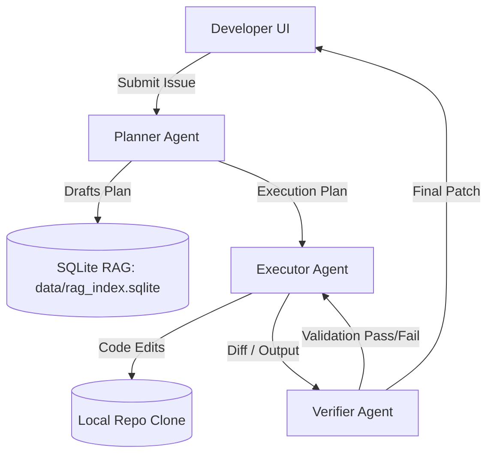

# TaskChain — Autonomous Coding Workspace

TaskChain is a developer agent system designed to automate public GitHub repository issue resolution. It features a streamlined **Planner → Executor → Verifier** pipeline that works autonomously to solve code issues, backed by a simple web interface.

---

## Key Features

1. **Planner → Executor → Verifier Pipeline**
   - **Planner:** Analyzes the GitHub issue and repository context to formulate a step-by-step resolution plan.
   - **Executor:** Executes the planned steps by modifying files locally within the repository clone.
   - **Verifier:** Evaluates the changes to ensure they resolve the issue without introducing new errors.

2. **SQLite RAG Indexing**
   - repository data and documentation are indexed into a lightweight `data/rag_index.sqlite` database.
   - Includes an optional rerank mode to improve context retrieval quality.

3. **OpenAI LLM Integration**
   - Fully integrated with OpenAI's models to drive the autonomous coding pipeline.

4. **Minimal UI Homepage**
   - Features a clean, minimalistic web interface to connect repositories, submit issues, and view the agent's progress.

---

## System Architecture

The core of TaskChain revolves around a linear, self-correcting agent pipeline:



---

## Getting Started

### Prerequisites
- Python 3.10+
- OpenAI API Key

### 1. Installation
Clone the repository and set up a virtual environment:
```bash
python -m venv venv
source venv/bin/activate
pip install -r requirements.txt
```

### 2. Configuration
Create a `.env` file in the root directory.

```env
# OpenAI API Key
OPENAI_API_KEY=your_openai_api_key_here

# Database URL Connection String
DATABASE_URL=sqlite:///data/rag_index.sqlite
```

### 3. Running the Server
Start the minimal UI server:
```bash
python -m uvicorn api.server:app --reload
```
Open your browser and navigate to `http://localhost:8000` to interact with TaskChain.

### 4. Running the Tests
To run all test suites:
```bash
PYTHONPATH=. venv/bin/pytest -v
```
